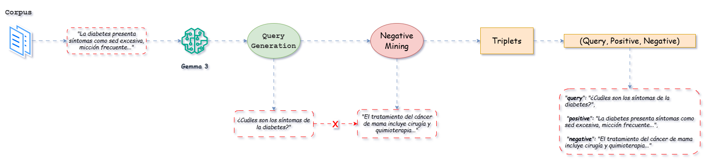

# Adaptación de Dominio en Embeddings

Este proyecto explora técnicas de adaptación de dominio para mejorar el rendimiento de modelos de embeddings en el ámbito médico en español. Se parte de un modelo preentrenado y se ajusta su representación semántica utilizando datos sintéticos generados automáticamente a partir de un corpus biomédico.

## Objetivo

Optimizar representaciones vectoriales para datos médicos en español, mejorando la recuperación semántica en contextos especializados mediante técnicas sin supervisión como *Generative Pseudo Labeling* (GPL) y entrenamiento con funciones de pérdida basadas en triplets.

## Metodología

* **Corpus**: Se utilizó CoWeSe, un corpus biomédico web en español (750M tokens), del cual se extrajo una muestra representativa y se aplicaron filtros de calidad y relevancia médica.
* **Generación sintética**: A partir de los textos validados, se generaron queries automáticas utilizando el modelo Gemma 3, creando datasets estructurados para entrenamiento.
* **Modelo base**: Se empleó `paraphrase-spanish-distilroberta`, optimizado para el español.
* **Entrenamiento**: Se implementaron funciones de pérdida `TripletLoss` y `MultipleNegativesRankingLoss` usando la librería `Sentence Transformers`.
* **Evaluación**: Las métricas incluyeron Precision\@k, Recall\@k, NDCG\@k y MRR\@k. Los experimentos fueron monitoreados con Weights & Biases.

## Tecnologías

* Python
* Hugging Face Transformers
* Sentence Transformers
* LangChain + Ollama
* spaCy
* Wandb

## Autor

Christian Nahuel Botta | Práctica para Redes Neuronales Artificiales | 2025

