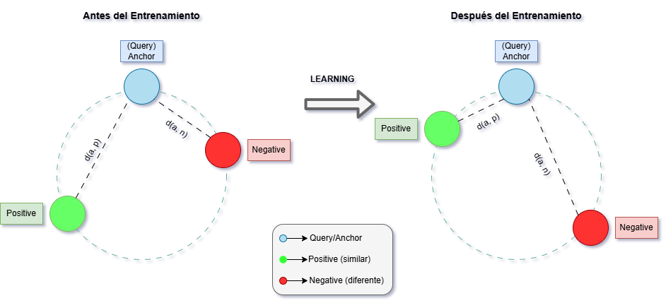

# Adaptación de Dominio en Embeddings

Este proyecto explora técnicas de adaptación de dominio para mejorar el rendimiento de modelos de embeddings en el ámbito médico en español. Se parte de un modelo preentrenado y se ajusta su representación semántica utilizando datos sintéticos generados automáticamente a partir de un corpus biomédico.

## Objetivo

Optimizar representaciones vectoriales para datos médicos en español, mejorando la recuperación semántica en contextos especializados mediante técnicas sin supervisión como *Generative Pseudo Labeling* (GPL) y entrenamiento con funciones de pérdida basadas en triplets.

## Metodología

* **Corpus**: Se utilizó CoWeSe, un corpus biomédico web en español (750M tokens), del cual se extrajo una muestra representativa y se aplicaron filtros de calidad y relevancia médica.
* **Generación sintética**: A partir de los textos validados, se generaron queries automáticas utilizando el modelo Gemma 3, creando datasets estructurados para entrenamiento.
* **Modelo base**: Se empleó `paraphrase-spanish-distilroberta`, optimizado para el español.
* **Entrenamiento**: Se implementaron funciones de pérdida `TripletLoss` y `MultipleNegativesRankingLoss` usando la librería `Sentence Transformers`.
* **Evaluación**: Las métricas incluyeron Precision\@k, Recall\@k, NDCG\@k y MRR\@k. Los experimentos fueron monitoreados con Weights & Biases.

## Resultados y Recursos

### Datasets Generados

Los siguientes datasets fueron construidos a partir del corpus CoWeSe, filtrados y estructurados para el entrenamiento del modelo adaptado:

* [`cowese-qa-dataset`](https://huggingface.co/datasets/chrisnb1/cowese-qa-dataset): Dataset de preguntas generadas automáticamente (contexto + 3 queries por entrada).
* [`cowese-triplet-dataset`](https://huggingface.co/datasets/chrisnb1/cowese-triplet-dataset): Dataset estructurado en tripletas (query, positive, negative) para entrenamiento con pérdida tipo triplet y MNRL.

---

### Entrenamiento

El monitoreo y visualización del proceso de entrenamiento fue realizado utilizando **Weights & Biases (Wandb)**:
[Visualizar en Wandb](https://wandb.ai/chrisnb1/sentence-transformers?nw=nwuserchrisbotta1)

##  Funciones de Pérdida Utilizadas

Durante el entrenamiento del modelo se utilizaron dos funciones de pérdida ampliamente empleadas en la adaptación de modelos de embeddings. A continuación, se presenta una descripción teórica de cada una.

---

### 1. Triplet Loss

La función de pérdida `Triplet Loss` busca minimizar la distancia entre un ejemplo positivo y su correspondiente consulta (*anchor*), mientras maximiza la distancia entre la consulta y un ejemplo negativo.

Para cada tripleta $(a, p, n)$, donde:

* $a$ es el *anchor* (por ejemplo, una pregunta generada)
* $p$ es el *positive* (el contexto médico original)
* $n$ es un *negative* (un contexto no relacionado)

La función se define como:

$$
L = \max(0, d(a, p) - d(a, n) + \text{margin})
$$

Donde:

* $d(a, p)$ es la distancia (por ejemplo, coseno) entre el *anchor* y el *positive*
* $d(a, n)$ es la distancia entre el *anchor* y el *negative*
* `margin` es un hiperparámetro que define la separación mínima deseada

---

### 2. Multiple Negatives Ranking Loss (MNRL)

La función `MNR Loss` optimiza el modelo para que, dada una consulta, el *positive* correcto tenga una similitud mayor que todos los demás ejemplos en el batch (que actúan como *negatives* implícitos).

La pérdida para una consulta $q$ y su positivo $p$ es:

$$
L = -\log \frac{\exp(\text{sim}(q, p)/\tau)}{\sum_{i=1}^{N} \exp(\text{sim}(q, n_i)/\tau)}
$$

Donde:

* $\text{sim}(q, p)$ es la similitud (por ejemplo, coseno) entre $q$ y $p$
* $n_i$ son los *negatives* dentro del mismo batch
* $\tau$ es un hiperparámetro de temperatura que suaviza las similitudes

## Tecnologías

* Python
* Hugging Face Transformers
* Sentence Transformers
* LangChain + Ollama
* spaCy
* Wandb

## Autor

Christian Nahuel Botta | Práctica para Redes Neuronales Artificiales | 2025

